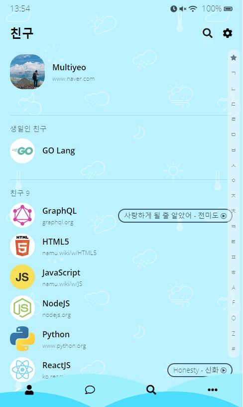
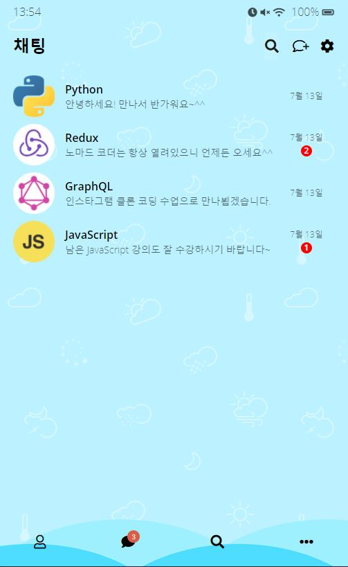
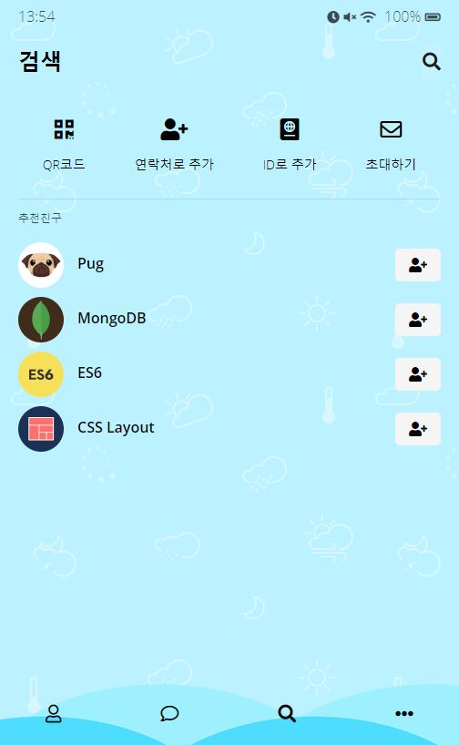

# 카카오 클론 코딩
Javascript와 CSS Study을 위한 카카오톡 클론 코딩

```json
{
  "name":"Kakao Clone",
  "skills": [
    "HTML5",
    "CSS3",
    "VSCode",
    "Github Desktop",
    "Font Awesome"
  ]
}
```

## 이론
- IDs & Classes
- HTML Tags
- Semantic & non-semantic tags
- Box Model
- Inline, Block, inline-block
- CSS Position
- Flexbox
- Selectors
- Pseudo Selectors
- Transitions
- Animations
- Media Queries

## 기능
- Status Bar
- Chat
- Friends
- Find
- Settings
- Message Animations
- Chats
- More

## 스크린샷








